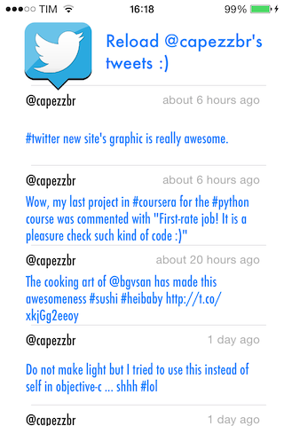

AsyncRequest
============

Wrapper of NSURLConnection that helps the developer to create an asynchronous request for retrieving data from a script with few line of code.

Usage
---------
```objective-c
AsyncRequest *request =
[AsyncRequest requestWithURL:@"http://site/script"
                      params:@{@"integerParameter": [NSNumber numberWithInt:20], @"stringParameter": @"empty"}
                   onSuccess:^(NSData *data) {
                       /* execute data */
                  } onErrror:^(NSError *error) {
                       /* manage error */
                  }];
[request setTimeoutInterval:8]; // seconds
[request start];
```

Result
---------


How To Get Started 
---------
1. Drag & drop inside your project the folder named **AsyncRequest**
2. That's all!

Unit Tests
---------
Some **unit tests** are available [here](/example/AsyncRequest/AsyncRequestTests/AsyncRequestTests.m)

License 
---------
AsyncRequest is available under the MIT license. See the LICENSE file for more info.